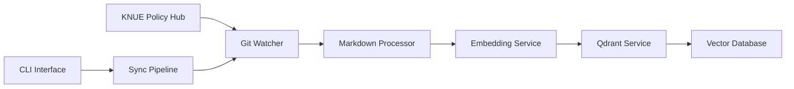
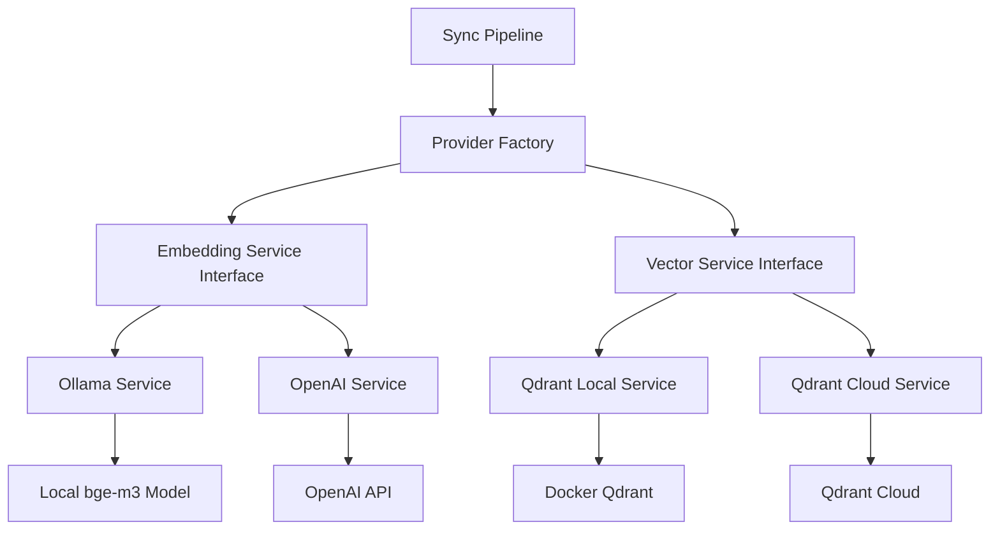

# KNUE Policy Vectorizer

한국교원대학교 정책 문서를 Qdrant 벡터 데이터베이스에 동기화하는 자동화 파이프라인

[](./tests)
[](https://python.org)
[](https://qdrant.tech)
[](https://huggingface.co/BAAI/bge-m3)
[](./README.md#multi-provider-support-new)
[](https://docker.com)
[](./tests)

## 📋 개요

KNUE Policy Vectorizer는 [한국교원대학교 정책 Hub](https://github.com/kadragon/KNUE-Policy-Hub) 저장소의 마크다운 정책 문서들을 자동으로 처리하여 Qdrant 벡터 데이터베이스에 저장하는 시스템입니다.

### 🎯 주요 기능

- **📂 Git 저장소 자동 감시**: 정책 문서 변경사항 실시간 추적
- **📝 마크다운 전처리**: Frontmatter 제거, 제목 추출, 메타데이터 생성
- **✂️ 스마트 문서 청킹**: 800토큰 기준 청킹 + 200토큰 컨텍스트 오버랩
- **🔄 Multi-Provider 지원**: Ollama/OpenAI 임베딩, Local/Cloud Qdrant 선택 가능
- **🤖 임베딩 생성**: BGE-M3(1024차원) 또는 OpenAI(1536/3072차원) 벡터 생성
- **🔍 벡터 검색**: Qdrant Local/Cloud를 통한 고성능 유사도 검색
- **⚡ 증분 동기화**: 변경된 파일만 선별적으로 처리
- **🔄 전체 재인덱싱**: 필요시 전체 문서 재처리
- **📦 Provider 마이그레이션**: 서비스 간 벡터 데이터 마이그레이션 도구
- **🚀 고성능 배치 처리**: 임베딩 생성 및 벡터 저장 최적화
- **💻 CLI 인터페이스**: 명령줄을 통한 쉬운 조작 및 설정 관리

## 🏗️ 시스템 아키텍처



### 구성요소

- **GitWatcher**: Git 저장소 모니터링 및 변경사항 추적
- **MarkdownProcessor**: 마크다운 문서 전처리, 스마트 청킹 및 메타데이터 추출
- **Provider Factory**: 다중 임베딩/벡터 서비스 동적 생성 및 관리
- **EmbeddingService**: Ollama(BGE-M3) 또는 OpenAI 임베딩 생성 (배치 처리 최적화)
- **QdrantService**: 로컬/클라우드 벡터 데이터베이스 연동 및 관리
- **Migration Tools**: Provider 간 벡터 데이터 마이그레이션 및 호환성 검사
- **Configuration Manager**: 고급 설정 관리, 템플릿, 백업/복원
- **SyncPipeline**: 전체 파이프라인 오케스트레이션 및 CLI 인터페이스

## 🚀 빠른 시작

### 전제 조건

- **Python 3.9+** (Python 3.11 권장)
- **[uv](https://docs.astral.sh/uv/)** 패키지 매니저
- **[Ollama](https://ollama.com/)** (bge-m3 모델)
- **[Docker & Docker Compose](https://docker.com)** (Qdrant 실행용)
- **최소 2GB RAM** (임베딩 처리용)

### 1. 저장소 클론 및 설정

```bash
git clone https://github.com/yourusername/knue-policy-vectorizer.git
cd knue-policy-vectorizer

# uv 패키지 매니저 설치 (없는 경우)
curl -LsSf https://astral.sh/uv/install.sh | sh

# 의존성 설치 및 개발 환경 구성
uv sync

# 개발 모드로 패키지 설치
uv pip install -e .
```

### 2. 외부 서비스 설정

#### Ollama 설정 (필수)

```bash
# Ollama 설치 및 실행
ollama serve

# bge-m3 임베딩 모델 다운로드 (약 2.2GB)
ollama pull bge-m3

# 모델 확인
ollama list
```

#### Qdrant 설정 (Docker)

```bash
# Qdrant 벡터 데이터베이스만 시작 (개발용)
docker-compose up -d qdrant

# 상태 확인
curl http://localhost:6333/collections

# 대시보드 접근 (선택사항)
# http://localhost:6333/dashboard
```

### 3. 환경 설정 (선택사항)

```bash
# 기본 설정 파일 복사
cp .env.example .env

# 필요시 설정 수정
vim .env
```

### 4. 시스템 검증

```bash
# 모든 서비스 상태 확인
uv run python -m src.sync_pipeline health

# 출력 예시:
# 🔍 Checking service health...
# ✅ All services are healthy
```

### 5. 첫 동기화 실행

```bash
# 전체 재인덱싱 (최초 실행 권장)
uv run python -m src.sync_pipeline reindex

# 또는 증분 동기화
uv run python -m src.sync_pipeline sync
```

## 💻 사용법

### CLI 명령어

이 시스템은 다음과 같은 주요 명령어를 제공합니다:

#### 1. 헬스체크

```bash
# 모든 서비스 상태 확인
uv run python -m src.sync_pipeline health

# 출력 예시:
# 🔍 Checking service health...
# ✅ All services are healthy
#   - Qdrant: Connected (localhost:6333)
#   - Ollama: Connected (bge-m3 model ready)
#   - Git Repository: Accessible
```

#### 2. 증분 동기화 (권장)

```bash
# 변경된 파일만 처리
uv run python -m src.sync_pipeline sync

# 출력 예시:
# 🔄 Starting sync pipeline...
# ✅ Sync completed successfully
#   - Processed: 3 files
#   - Upserted: 3 vectors
#   - Deleted: 0 vectors
#   - Skipped: 97 files (no changes)
```

#### Cloudflare R2 동기화

```bash
uv run python -m src.sync_pipeline sync-cloudflare-r2
# 출력: Cloudflare R2 전용 업로드/삭제 결과와 객체 수
```

> ⚠️ `sync-cloudflare-r2` 명령은 Cloudflare 업로드/삭제 실패 시 즉시 종료(exit code 1)하며 자세한 오류 로그를 출력합니다.

#### 3. 전체 재인덱싱

```bash
# 모든 파일을 재처리 (최초 실행 또는 전체 재구축 시)
uv run python -m src.sync_pipeline reindex

# 출력 예시:
# 🔄 Starting full reindex...
# ✅ Reindex completed successfully
#   - Total files: 100
#   - Successfully processed: 98
#   - Failed: 2 (token limit exceeded)
#   - Total vectors: 98
```

#### 4. KNUE 게시판 동기화 (신규)

교원대 홈페이지 게시판의 RSS를 읽고, 상세 HTML을 파싱해 Qdrant 컬렉션(`www-board-data`)에 저장합니다.

```bash
# 기본: .env의 BOARD_INDICES 사용
uv run python -m src.sync_pipeline board-sync

# 특정 게시판만 지정해서 실행 (반복 지정 가능)
uv run python -m src.sync_pipeline board-sync --board-idx 25 --board-idx 26

# 게시판 전체 재인덱싱 (문제 발생 시)
uv run python -m src.sync_pipeline board-reindex

# 특정 게시판만 재인덱싱
uv run python -m src.sync_pipeline board-reindex --board-idx 25

# 컬렉션 삭제 후 재인덱싱 (완전 재구축)
uv run python -m src.sync_pipeline board-reindex --drop-collection
```

**동작 방식**:

- **board-sync**: 
  - 최초 실행: 해당 게시판에 기존 데이터가 없으면 RSS의 모든 항목을 1회 전체 색인
  - 이후 실행: `BOARD_MAX_AGE_DAYS` 내의 최신 글만 증분 색인

- **board-reindex**:
  - 특정 게시판만 선택적 재인덱싱 가능
  - `--drop-collection`: 전체 게시판 컬렉션 삭제 후 재생성
  - 보존 기간(`BOARD_RETENTION_DAYS`) 내의 모든 글을 전체 재처리

환경 변수:
- `BOARD_RSS_TEMPLATE` (기본: https://www.knue.ac.kr/rssBbsNtt.do?bbsNo={board_idx})
- `BOARD_INDICES` (예: 25,26,11,207,28,256)
- `QDRANT_BOARD_COLLECTION` (기본: www-board-data)
- `BOARD_MAX_AGE_DAYS` (기본: 1)
- 게시판 청킹은 전역 `CHUNK_THRESHOLD` / `CHUNK_OVERLAP` 값을 그대로 사용합니다.

임베딩 프로바이더는 기존 설정을 그대로 사용합니다. OpenAI 대형 임베딩을 사용하려면 다음을 설정하세요:

```env
EMBEDDING_PROVIDER=openai
OPENAI_API_KEY=sk-...
OPENAI_MODEL=text-embedding-3-large
```

스케줄링(예시, 매일 새벽 1시):

```cron
0 1 * * * cd /path/to/knue-policy-vectorizer && \
  uv run python -m src.sync_pipeline board-sync >> logs/board_sync.log 2>&1
```

### 환경 설정

`.env` 파일을 생성하여 설정을 커스터마이즈할 수 있습니다:

```bash
# 기본 설정 파일 복사
cp .env.example .env
```

#### 주요 설정 옵션

```env
# Git 저장소 설정
GIT_REPO_URL=https://github.com/kadragon/KNUE-Policy-Hub.git
GIT_BRANCH=main

# 🔧 Provider 선택 (NEW)
EMBEDDING_PROVIDER=ollama        # ollama, openai
VECTOR_PROVIDER=qdrant_local     # qdrant_local, qdrant_cloud

# Ollama 설정 (Local Embeddings)
OLLAMA_URL=http://localhost:11434
OLLAMA_MODEL=bge-m3              # 또는 EMBEDDING_MODEL

# OpenAI 설정 (Cloud Embeddings) - NEW
OPENAI_API_KEY=sk-...            # OpenAI API 키 (필수, openai provider 사용시)
OPENAI_MODEL=text-embedding-3-small  # text-embedding-3-small, text-embedding-3-large
OPENAI_BASE_URL=https://api.openai.com/v1  # 커스텀 엔드포인트 (선택사항)

# Qdrant Local 설정
QDRANT_URL=http://localhost:6333

# Qdrant Cloud 설정 (NEW)
QDRANT_CLOUD_URL=https://your-cluster.qdrant.tech  # Qdrant Cloud URL
QDRANT_API_KEY=your-api-key      # Qdrant Cloud API 키

# Cloudflare R2 (Markdown 동기화, 명령어: sync-cloudflare-r2)
CLOUDFLARE_ACCOUNT_ID=your-account-id
CLOUDFLARE_R2_ACCESS_KEY_ID=your-access-key
CLOUDFLARE_R2_SECRET_ACCESS_KEY=your-secret-key
CLOUDFLARE_R2_BUCKET=knue-vectorstore
CLOUDFLARE_R2_ENDPOINT=https://your-account-id.r2.cloudflarestorage.com/knue-vectorstore
# 선택 사항
# CLOUDFLARE_R2_KEY_PREFIX=policies/
# CLOUDFLARE_R2_SOFT_DELETE_ENABLED=false
# CLOUDFLARE_R2_SOFT_DELETE_PREFIX=deleted/

# 컬렉션 설정
COLLECTION_NAME=knue_policies
VECTOR_SIZE=1024                 # Provider에 따라 자동 조정: bge-m3(1024), openai-small(1536), openai-large(3072)

# 처리 제한
MAX_TOKEN_LENGTH=8192           # 임베딩 서비스 최대 토큰 제한 (bge-m3: 8192, openai: 8191)
CHUNK_THRESHOLD=800             # 문서 청킹 임계값 (더 나은 검색 성능)
CHUNK_OVERLAP=200              # 청크 간 컨텍스트 오버랩 토큰 수
MAX_DOCUMENT_CHARS=30000
BATCH_SIZE=10

# 로깅
LOG_LEVEL=INFO
LOG_FILE=logs/vectorizer.log
```

### 고급 사용법

#### 상세 로그 출력

```bash
# DEBUG 레벨 로그로 실행
LOG_LEVEL=DEBUG uv run python -m src.sync_pipeline sync

# 또는 환경 변수로 설정
export LOG_LEVEL=DEBUG
uv run python -m src.sync_pipeline sync
```

#### 특정 설정으로 실행

```bash
# 다른 저장소 URL로 실행
GIT_REPO_URL=https://github.com/your-org/your-repo.git uv run python -m src.sync_pipeline sync

# 다른 컬렉션 이름으로 실행
COLLECTION_NAME=test_collection uv run python -m src.sync_pipeline reindex
```

#### 프로그래매틱 사용

```python
from src.sync_pipeline import SyncPipeline
from src.config import Config

# 기본 설정으로 파이프라인 생성
pipeline = SyncPipeline()

# 헬스체크
health_status = pipeline.health_check()

# 동기화 실행
sync_result = pipeline.sync()

# 커스텀 설정으로 파이프라인 생성
config = Config()
config.qdrant_url = "http://custom-qdrant:6333"
pipeline = SyncPipeline(config)
```

## 🔄 Multi-Provider Support (NEW)

KNUE Policy Vectorizer는 이제 여러 임베딩 서비스와 벡터 데이터베이스를 지원합니다!

### 🎯 지원되는 Provider

#### Embedding Providers
- **Ollama** (Local): bge-m3 모델, 1024차원 벡터
- **OpenAI** (Cloud): text-embedding-3-small(1536차원), text-embedding-3-large(3072차원)

#### Vector Providers  
- **Qdrant Local**: Docker로 로컬 실행
- **Qdrant Cloud**: 관리형 클라우드 서비스

### 🚀 Provider 설정 방법

#### 1. 환경 변수로 설정

```bash
# Ollama + Local Qdrant (기본값)
export EMBEDDING_PROVIDER=ollama
export VECTOR_PROVIDER=qdrant_local

# OpenAI + Local Qdrant
export EMBEDDING_PROVIDER=openai
export VECTOR_PROVIDER=qdrant_local
export OPENAI_API_KEY=sk-your-api-key

# OpenAI + Qdrant Cloud (프로덕션 추천)
export EMBEDDING_PROVIDER=openai
export VECTOR_PROVIDER=qdrant_cloud
export OPENAI_API_KEY=sk-your-api-key
export QDRANT_CLOUD_URL=https://your-cluster.qdrant.tech
export QDRANT_API_KEY=your-qdrant-api-key
```

#### 2. CLI 명령어로 Provider 관리

```bash
# 사용 가능한 Provider 확인
uv run python -m src.sync_pipeline list-providers

# 현재 설정 확인
uv run python -m src.sync_pipeline show-config

# Provider 연결 테스트
uv run python -m src.sync_pipeline test-providers

# 대화형 Provider 설정
uv run python -m src.sync_pipeline configure

# 특정 Provider로 일회성 실행
uv run python -m src.sync_pipeline --embedding-provider openai --vector-provider qdrant_cloud sync
```

#### 3. 설정 템플릿 사용

```bash
# 사용 가능한 템플릿 확인
uv run python -m src.sync_pipeline config-templates

# 템플릿으로 설정 생성
uv run python -m src.sync_pipeline config-from-template openai-cloud

# 설정 검증
uv run python -m src.sync_pipeline config-validate
```

### 📋 Provider 비교

| Provider | 장점 | 단점 | 사용 사례 |
|----------|------|------|-----------|
| **Ollama (Local)** | 무료, 개인정보 보호, 오프라인 가능 | 초기 설정 복잡, GPU 필요 | 개발, 개인 프로젝트, 높은 보안 요구사항 |
| **OpenAI (Cloud)** | 빠른 속도, 고품질 임베딩, 관리 불필요 | 비용 발생, API 키 필요 | 프로덕션, 상업적 사용, 빠른 배포 |
| **Qdrant Local** | 무료, 완전 제어, 개인정보 보호 | 자원 관리 필요, 확장성 제한 | 개발, 소규모 배포 |
| **Qdrant Cloud** | 자동 확장, 고가용성, 관리 불필요 | 비용 발생, 네트워크 의존 | 프로덕션, 대규모 배포 |

### 🏗️ Multi-Provider 아키텍처



### 🔧 Provider 설정 가이드

#### OpenAI 설정

```bash
# 1. OpenAI API 키 발급
# https://platform.openai.com/api-keys

# 2. 환경 변수 설정
export OPENAI_API_KEY=sk-your-api-key-here
export OPENAI_MODEL=text-embedding-3-small  # 또는 text-embedding-3-large

# 3. 연결 테스트
uv run python -m src.sync_pipeline test-providers

# 4. 첫 동기화
uv run python -m src.sync_pipeline --embedding-provider openai sync
```

#### Qdrant Cloud 설정

```bash
# 1. Qdrant Cloud 클러스터 생성
# https://cloud.qdrant.io/

# 2. API 키 및 URL 획득
export QDRANT_CLOUD_URL=https://your-cluster-id.qdrant.tech
export QDRANT_API_KEY=your-api-key

# 3. 연결 테스트
uv run python -m src.sync_pipeline test-providers

# 4. 클라우드로 동기화
uv run python -m src.sync_pipeline --vector-provider qdrant_cloud sync
```

### 🔄 Provider 마이그레이션

#### 🔒 마이그레이션 안전 기능 (NEW)

마이그레이션은 **매우 신중하게** 수행해야 하는 작업입니다. 시스템에는 다음과 같은 안전장치가 내장되어 있습니다:

**다중 확인 절차**:
- 첫 번째 확인: "모든 벡터 데이터를 마이그레이션하시겠습니까?"
- 두 번째 확인: 정확한 마이그레이션 경로 텍스트 입력 필요
- 예: `ollama/qdrant_local-to-openai/qdrant_cloud` 정확히 타이핑

**마이그레이션 보고서**:
- 기본적으로 **보고서 생성 안함** (보안상 안전)
- 필요시 `--save-report` 플래그로 명시적 활성화

#### 마이그레이션 도구 사용

```bash
# 1. 호환성 먼저 확인 (DRY RUN 권장)
uv run python -m src.sync_pipeline migrate \
  --from-embedding ollama --from-vector qdrant_local \
  --to-embedding openai --to-vector qdrant_cloud \
  --dry-run

# 2. 백업 생성 (필수!)
uv run python -m src.sync_pipeline backup backups/migration_backup.json

# 3. 실제 마이그레이션 (신중하게!)
uv run python -m src.sync_pipeline migrate \
  --from-embedding ollama --from-vector qdrant_local \
  --to-embedding openai --to-vector qdrant_cloud \
  --backup --save-report

# 4. 성능 비교
uv run python -m src.sync_pipeline compare-performance

# 5. 백업에서 복구 (필요시)
uv run python -m src.sync_pipeline restore backups/migration_backup.json
```

⚠️ **마이그레이션 주의사항**:
- 항상 `--dry-run`으로 먼저 테스트
- 백업 없이는 절대 마이그레이션 금지
- 정확한 확인 텍스트 입력 필요
- 프로덕션에서는 반드시 점검 시간에 수행

#### 단계별 마이그레이션 가이드

**1. Ollama → OpenAI 마이그레이션**

```bash
# 현재 상태 백업
uv run python -m src.sync_pipeline backup backups/ollama_backup.json

# OpenAI 설정
export OPENAI_API_KEY=sk-your-key
export EMBEDDING_PROVIDER=openai

# 호환성 확인 (차원 불일치 경고 예상)
uv run python -m src.sync_pipeline check-compatibility

# 전체 재인덱싱 (필수 - 벡터 차원이 다름)
uv run python -m src.sync_pipeline reindex
```

**2. Local Qdrant → Cloud Qdrant 마이그레이션**

```bash
# 현재 벡터 백업
uv run python -m src.sync_pipeline backup backups/local_vectors.json

# Qdrant Cloud 설정
export QDRANT_CLOUD_URL=https://your-cluster.qdrant.tech
export QDRANT_API_KEY=your-api-key
export VECTOR_PROVIDER=qdrant_cloud

# 벡터 마이그레이션 (같은 차원이면 재임베딩 불필요)
uv run python -m src.sync_pipeline migrate --backup-first
```

### 📊 Provider 성능 비교

#### 임베딩 성능 (100개 문서 기준)

| Provider | 평균 시간/문서 | 배치 처리 | 벡터 차원 | 비용 |
|----------|----------------|-----------|-----------|------|
| Ollama bge-m3 | 0.129초 | ✅ 지원 | 1024 | 무료 |
| OpenAI text-embedding-3-small | 0.045초 | ✅ 지원 | 1536 | $0.00002/1K tokens |
| OpenAI text-embedding-3-large | 0.053초 | ✅ 지원 | 3072 | $0.00013/1K tokens |

#### 벡터 스토리지 성능

| Provider | 연결 지연 | 배치 업서트 | 확장성 | 가용성 |
|----------|-----------|-------------|--------|--------|
| Qdrant Local | <1ms | ✅ 지원 | 단일 노드 | 수동 관리 |
| Qdrant Cloud | 10-50ms | ✅ 지원 | 자동 확장 | 99.9% SLA |

### 🔧 고급 설정 관리

#### 설정 백업 및 복원

```bash
# 현재 설정 백업
uv run python -m src.sync_pipeline config-backup

# 백업 목록 확인
uv run python -m src.sync_pipeline config-backups

# 설정 내보내기 (JSON/ENV/YAML)
uv run python -m src.sync_pipeline config-export --format json > my_config.json
uv run python -m src.sync_pipeline config-export --format env > my_config.env

# 정리 작업 (30일 이전 백업 삭제)
uv run python -m src.sync_pipeline config-cleanup --days 30
```

#### 환경별 설정 프로파일

```bash
# 개발 환경 설정
cat > .env.dev << EOF
EMBEDDING_PROVIDER=ollama
VECTOR_PROVIDER=qdrant_local
LOG_LEVEL=DEBUG
BATCH_SIZE=5
EOF

# 프로덕션 환경 설정  
cat > .env.prod << EOF
EMBEDDING_PROVIDER=openai
VECTOR_PROVIDER=qdrant_cloud
OPENAI_API_KEY=sk-prod-key
QDRANT_CLOUD_URL=https://prod-cluster.qdrant.tech
QDRANT_API_KEY=prod-api-key
LOG_LEVEL=INFO
BATCH_SIZE=20
EOF

# 환경별 실행
uv run --env-file .env.dev python -m src.sync_pipeline sync    # 개발
uv run --env-file .env.prod python -m src.sync_pipeline sync   # 프로덕션
```

### 💡 Best Practices

#### 개발 환경 추천 설정
```bash
EMBEDDING_PROVIDER=ollama           # 무료, 빠른 반복 개발
VECTOR_PROVIDER=qdrant_local        # 로컬 개발, 데이터 격리
LOG_LEVEL=DEBUG                     # 상세 디버깅
BATCH_SIZE=5                        # 메모리 절약
```

#### 프로덕션 환경 추천 설정
```bash
EMBEDDING_PROVIDER=openai           # 고품질, 안정적 서비스
VECTOR_PROVIDER=qdrant_cloud        # 확장성, 고가용성
OPENAI_MODEL=text-embedding-3-small # 비용 대비 성능 최적
LOG_LEVEL=INFO                      # 적절한 로그 레벨
BATCH_SIZE=20                       # 처리 성능 최적화
```

#### 비용 최적화 팁
1. **OpenAI 사용량 모니터링**: API 대시보드에서 토큰 사용량 추적
2. **배치 크기 조정**: `BATCH_SIZE`를 늘려 API 호출 횟수 감소
3. **문서 필터링**: 불필요한 문서 제외로 처리량 감소
4. **Chunking 최적화**: `CHUNK_THRESHOLD` 조정으로 청크 수 최적화

## 🧪 테스트

### 전체 테스트 실행

```bash
# 모든 단위 테스트 실행
uv run pytest tests/ -v

# 특정 모듈 테스트
uv run pytest tests/test_sync_pipeline.py -v

# 통합 테스트 실행
uv run python scripts/test_full_sync_pipeline.py
```

### 테스트 커버리지

현재 **189개의 테스트**가 모든 주요 기능을 검증합니다:

#### Core Functionality
- ✅ Git 저장소 감시 (13개 테스트)
- ✅ 마크다운 전처리 (17개 테스트)
- ✅ 임베딩 생성 (20개 테스트)
- ✅ Qdrant 연동 (25개 테스트)
- ✅ 동기화 파이프라인 (21개 테스트)
- ✅ 기본 설정 (5개 테스트)
- ✅ Qdrant 연결 (4개 테스트)

#### Multi-Provider Support (NEW)
- ✅ Provider 팩토리 및 인터페이스 (24개 테스트)
- ✅ OpenAI 임베딩 서비스 (20개 테스트)
- ✅ Qdrant Cloud 서비스 (23개 테스트)
- ✅ 마이그레이션 도구 (20개 테스트)
- ✅ 설정 관리 (17개 테스트)

## 📊 성능

### 벤치마크 결과

- **임베딩 생성**: 평균 0.129초/문서 (배치 처리 시 2.12x 성능 향상)
- **벡터 저장**: 평균 0.012초/문서 (배치 업서트 최적화)
- **문서 청킹**: 800토큰 단위로 컨텍스트 유지하며 분할
- **배치 처리**: 다중 청크 문서의 임베딩/저장 최적화
- **검색 속도**: 1000개 문서에서 < 0.1초
- **메모리 사용량**: 약 500MB (1000개 문서 기준)

### 처리 가능한 문서 유형

- ✅ 한국어 정책 문서
- ✅ YAML/TOML Frontmatter 포함 마크다운
- ✅ 최대 8,192 토큰 (약 30,000자)
- ✅ UTF-8 인코딩

## 🔧 개발

### 프로젝트 구조

```
knue-policy-vectorizer/
├── src/                          # 소스 코드
│   ├── config.py                 # 설정 관리
│   ├── git_watcher.py           # Git 저장소 감시
│   ├── markdown_processor.py    # 마크다운 전처리
│   ├── embedding_service.py     # 임베딩 생성
│   ├── qdrant_service.py        # Qdrant 연동
│   ├── sync_pipeline.py         # 메인 파이프라인
│   └── logger.py                # 로깅 설정
├── tests/                        # 테스트 코드
├── scripts/                      # 유틸리티 스크립트
├── config/                       # 설정 파일
└── test_data/                    # 테스트 데이터
```

### 개발 환경 설정

```bash
# 개발 의존성 설치
uv sync --group dev

# 코드 포맷팅
uv run black src/ tests/
uv run isort src/ tests/

# 타입 검사
uv run mypy src/

# 테스트 실행
uv run pytest tests/ -v --cov=src/
```

### TDD 개발 프로세스

이 프로젝트는 **테스트 주도 개발(TDD)** 방법론을 따릅니다:

1. 🔴 **Red**: 실패하는 테스트 작성
2. 🟢 **Green**: 테스트를 통과하는 최소 코드 작성
3. 🔵 **Refactor**: 코드 개선 및 최적화

## 🐳 Docker 배포

Docker를 사용하면 복잡한 환경 설정 없이 전체 시스템을 실행할 수 있습니다.

### 아키텍처

```
┌─────────────────┐    ┌─────────────────┐    ┌─────────────────┐
│   Host Machine  │    │  Docker Network │    │  Docker Network │
│                 │    │                 │    │                 │
│  Ollama:11434   │◄───┤  Indexer        │◄───┤  Qdrant:6333    │
│  bge-m3 model   │    │  (Python App)   │    │  (Vector DB)    │
└─────────────────┘    └─────────────────┘    └─────────────────┘
                              │
                              ▼
                    ┌─────────────────┐
                    │  Git Repository │
                    │  KNUE-Policy-Hub│
                    └─────────────────┘
```

### 빠른 시작

#### 1. 전제 조건

```bash
# Ollama가 호스트에서 실행 중인지 확인
ollama serve
ollama pull bge-m3

# Docker 상태 확인
docker --version
docker-compose --version
```

#### 2. 기본 실행 (자동 스케줄링)

```bash
# 모든 서비스 시작 (Qdrant + 자동 동기화)
docker-compose up -d

# 로그 확인
docker-compose logs -f indexer

# 서비스 상태 확인
docker-compose ps
```

#### 3. 수동 실행 (개발용)

```bash
# Qdrant만 시작
docker-compose up -d qdrant

# 일회성 동기화 실행
docker-compose run --rm indexer uv run python -m src.sync_pipeline sync

# 헬스체크
docker-compose run --rm indexer uv run python -m src.sync_pipeline health
```

### 고급 배포 옵션

#### Cron 스케줄링 (프로덕션 권장)

```bash
# Cron 기반 스케줄러 사용
docker-compose -f docker-compose.cron.yml up -d

# 스케줄 설정:
# - 매시간 sync (0 * * * *)
# - 15분마다 health check (*/15 * * * *)
# - 일요일 2시 전체 reindex (0 2 * * 0)
```

#### 환경 변수 커스터마이징

```bash
# Docker 전용 환경 설정 사용
cp .env.docker .env.production

# 환경 설정 수정
vim .env.production

# 커스텀 환경으로 실행
docker-compose --env-file .env.production up -d
```

### 관리 명령어

#### 서비스 관리

```bash
# 모든 서비스 중지
docker-compose down

# 특정 서비스만 재시작
docker-compose restart indexer

# 서비스 상태 확인
docker-compose ps

# 리소스 사용량 확인
docker-compose top
```

#### 로그 관리

```bash
# 실시간 로그 확인
docker-compose logs -f

# 특정 서비스 로그
docker-compose logs -f indexer
docker-compose logs -f qdrant

# 로그 파일 크기 제한
docker-compose logs --tail=100 indexer
```

#### 데이터 관리

```bash
# Qdrant 데이터 백업
docker run --rm -v knue-policy-vectorizer_qdrant_storage:/data \
  -v $(pwd)/backups:/backup alpine \
  tar czf /backup/qdrant-$(date +%Y%m%d).tar.gz -C /data .

# 볼륨 확인
docker volume ls | grep knue

# 볼륨 정리 (주의: 데이터 삭제됨)
docker-compose down -v
```

### 성능 튜닝

#### 메모리 설정

```yaml
# docker-compose.override.yml
services:
  indexer:
    deploy:
      resources:
        limits:
          memory: 1G
        reservations:
          memory: 512M
  qdrant:
    deploy:
      resources:
        limits:
          memory: 2G
```

#### 배치 크기 조정

```bash
# 메모리가 부족한 경우 배치 크기 줄이기
docker-compose run --rm \
  -e BATCH_SIZE=5 \
  indexer uv run python -m src.sync_pipeline sync
```

### 트러블슈팅

#### 일반적인 문제

**1. Ollama 연결 실패**

```bash
# 호스트에서 Ollama 상태 확인
curl http://localhost:11434/api/version

# Docker에서 호스트 접근 테스트
docker run --rm --add-host=host.docker.internal:host-gateway \
  alpine sh -c "wget -qO- http://host.docker.internal:11434/api/version"
```

**2. Qdrant 연결 실패**

```bash
# Qdrant 컨테이너 상태 확인
docker-compose ps qdrant

# Qdrant 로그 확인
docker-compose logs qdrant

# 수동 연결 테스트
docker-compose run --rm indexer curl http://qdrant:6333/collections
```

**3. 볼륨 권한 문제**

```bash
# 로그 디렉토리 권한 설정
mkdir -p logs repo_cache
chmod 755 logs repo_cache

# 소유권 변경 (필요한 경우)
sudo chown -R $(id -u):$(id -g) logs repo_cache
```

### 모니터링

#### Qdrant 대시보드

- URL: <http://localhost:6333/dashboard>
- 컬렉션 상태, 벡터 수, 메모리 사용량 확인

#### 헬스체크 엔드포인트

```bash
# Qdrant 헬스체크
curl http://localhost:6333/health

# 컨테이너 헬스체크
docker-compose ps --filter "health=healthy"
```

#### 로그 모니터링

```bash
# 에러 로그만 필터링
docker-compose logs indexer 2>&1 | grep ERROR

# 특정 시간 이후 로그
docker-compose logs --since="1h" indexer
```

자세한 Docker 사용법은 [DOCKER.md](DOCKER.md)를 참고하세요.

## 📈 모니터링

### 로그 수준

- `DEBUG`: 상세한 디버깅 정보
- `INFO`: 일반적인 작업 정보 (기본값)
- `WARNING`: 경고 메시지
- `ERROR`: 오류 정보

### 구조화된 로깅

모든 로그는 JSON 형태로 구조화되어 출력됩니다:

```json
{
  "event": "Sync completed",
  "pipeline": "sync",
  "status": "success",
  "upserted": 15,
  "deleted": 2,
  "failed": 0,
  "timestamp": "2025-01-01T12:00:00Z"
}
```

## 🛠️ 트러블슈팅

### 일반적인 문제

#### 1. 서비스 연결 문제

**Ollama 연결 실패**

```bash
# Ollama 서비스 상태 확인
curl http://localhost:11434/api/version

# Ollama 프로세스 확인
ps aux | grep ollama

# Ollama 재시작
pkill ollama
ollama serve

# bge-m3 모델 확인
ollama list
ollama pull bge-m3  # 없는 경우 다운로드
```

**Qdrant 연결 실패**

```bash
# Qdrant 상태 확인
curl http://localhost:6333/collections

# Docker 컨테이너 상태 확인
docker-compose ps qdrant

# Qdrant 재시작
docker-compose restart qdrant

# 포트 충돌 확인
lsof -i :6333
```

**Git 저장소 접근 문제**

```bash
# 저장소 접근 권한 확인
curl -I https://github.com/kadragon/KNUE-Policy-Hub.git

# SSH 키 설정 (Private 저장소인 경우)
ssh -T git@github.com

# 캐시 디렉토리 권한 확인
ls -la repo_cache/
rm -rf repo_cache/  # 필요시 캐시 삭제
```

#### 2. 성능 및 메모리 문제

**메모리 부족**

```bash
# 현재 메모리 사용량 확인
free -h

# 배치 크기 줄이기
export BATCH_SIZE=5

# 토큰 제한 줄이기
export MAX_TOKEN_LENGTH=4096

# Worker 수 조정
export MAX_WORKERS=2
```

**처리 속도 느림**

```bash
# 병렬 처리 늘리기 (메모리 충분한 경우)
export MAX_WORKERS=8
export BATCH_SIZE=20

# Ollama GPU 활용 확인
ollama ps  # GPU 사용량 확인

# 네트워크 지연 확인
ping localhost  # 로컬 서비스 응답 시간
```

#### 3. 데이터 관련 문제

**문서 처리 실패**

```bash
# 문제 문서 확인 (DEBUG 로그 활성화)
LOG_LEVEL=DEBUG uv run python -m src.sync_pipeline sync

# 특정 파일 토큰 수 확인
echo "문서 내용" | wc -w  # 대략적인 토큰 수

# 인코딩 문제 확인
file repo_cache/your-repo/*.md  # 파일 인코딩 확인
```

**벡터 검색 정확도 문제**

```bash
# 컬렉션 상태 확인
curl http://localhost:6333/collections/knue_policies

# 벡터 차원 확인 (1024여야 함)
curl http://localhost:6333/collections/knue_policies | jq '.result.config.params.vectors'

# 샘플 검색 테스트
uv run python -c "
from src.qdrant_service import QdrantService
from src.config import Config
qs = QdrantService(Config())
print(qs.search_similar_documents('대학원 입학', limit=3))
"
```

#### 4. Docker 관련 문제

**컨테이너 시작 실패**

```bash
# 도커 로그 확인
docker-compose logs indexer
docker-compose logs qdrant

# 이미지 재빌드
docker-compose build --no-cache indexer

# 볼륨 권한 문제
sudo chown -R $(id -u):$(id -g) repo_cache logs
```

**네트워크 연결 문제**

```bash
# Docker 네트워크 확인
docker network ls
docker network inspect knue-policy-vectorizer_knue-network

# 컨테이너 간 연결 테스트
docker-compose exec indexer ping qdrant
docker-compose exec indexer curl http://qdrant:6333/collections
```

### 로그 분석

#### 로그 레벨 설정

```bash
# DEBUG 레벨로 상세 정보 확인
LOG_LEVEL=DEBUG uv run python -m src.sync_pipeline sync

# 특정 컴포넌트만 디버그
LOG_LEVEL=INFO uv run python -m src.sync_pipeline sync 2>&1 | grep "ERROR\|WARNING"
```

#### 일반적인 에러 메시지

**"Failed to connect to Ollama"**

- Ollama 서비스가 실행되지 않음
- 포트 11434가 사용 중이 아님
- 해결: `ollama serve` 실행

**"Collection does not exist"**

- Qdrant 컬렉션이 생성되지 않음
- 해결: `uv run python -m src.sync_pipeline reindex` 실행

**"Token limit exceeded"**

- 문서가 8192 토큰 제한을 초과
- 해결: `MAX_TOKEN_LENGTH` 환경 변수 조정 또는 문서 분할

**"Git repository not found"**

- 저장소 URL이 잘못됨
- 해결: `GIT_REPO_URL` 환경 변수 확인

**"Provider not supported"** (NEW)

- 잘못된 provider 이름 사용
- 해결: `uv run python -m src.sync_pipeline list-providers`로 지원되는 provider 확인

**"OpenAI API key missing"** (NEW)

- OpenAI provider 사용 시 API 키 누락
- 해결: `export OPENAI_API_KEY=sk-your-key` 설정

**"Qdrant Cloud connection failed"** (NEW)

- Qdrant Cloud URL 또는 API 키 오류
- 해결: URL과 API 키 확인, 네트워크 연결 테스트

**"Vector dimension mismatch"** (NEW)

- Provider 변경 시 벡터 차원 불일치
- 해결: 전체 재인덱싱 필요 (`reindex` 명령 실행)

**"Migration cancelled - confirmation text did not match"** (NEW)

- 마이그레이션 확인 텍스트 불일치 (보안 기능)
- 해결: 정확한 마이그레이션 경로 텍스트 입력 (예: `ollama/qdrant_local-to-openai/qdrant_cloud`)

**"Migration report not saved"** (NEW)

- 마이그레이션 보고서가 기본적으로 생성되지 않음 (보안상 안전)
- 해결: 필요시 `--save-report` 플래그 사용

#### 로그 파일 위치

```bash
# 로컬 실행 시
tail -f logs/vectorizer.log

# Docker 실행 시
docker-compose logs -f indexer

# 특정 에러만 확인
grep "ERROR" logs/vectorizer.log
```

### 성능 최적화

#### 시스템 리소스 모니터링

```bash
# CPU/메모리 사용량 확인
htop

# Docker 리소스 사용량
docker stats

# 디스크 공간 확인
df -h
```

#### 설정 튜닝

```bash
# 고성능 서버용 설정
export MAX_WORKERS=12
export BATCH_SIZE=25
export MAX_TOKEN_LENGTH=8192

# 저사양 환경용 설정
export MAX_WORKERS=2
export BATCH_SIZE=5
export MAX_TOKEN_LENGTH=4096
```

### 복구 절차

#### 전체 시스템 재설정

```bash
# 1. 모든 서비스 중지
docker-compose down

# 2. 캐시 및 로그 정리
rm -rf repo_cache/* logs/*

# 3. Qdrant 데이터 삭제 (선택사항)
docker volume rm knue-policy-vectorizer_qdrant_storage

# 4. 서비스 재시작
docker-compose up -d

# 5. 전체 재인덱싱
docker-compose run --rm indexer uv run python -m src.sync_pipeline reindex
```

#### 특정 컬렉션만 재생성

```bash
# Qdrant 컬렉션 삭제
curl -X DELETE http://localhost:6333/collections/knue_policies

# 재인덱싱
uv run python -m src.sync_pipeline reindex
```

### 지원 및 도움

문제가 지속되는 경우:

1. **GitHub Issues**: [프로젝트 이슈 페이지](https://github.com/kadragon/knue-policy-vectorizer/issues)에 문제 리포트
2. **로그 첨부**: 에러 로그와 시스템 정보 포함
3. **환경 정보**: OS, Python 버전, Docker 버전 명시
4. **재현 단계**: 문제 발생 과정을 단계별로 설명

## 🤝 기여하기

1. 이슈 생성 또는 기존 이슈 확인
2. 포크 및 브랜치 생성
3. TDD 방식으로 개발:
   - 테스트 작성 → 구현 → 리팩토링
4. 모든 테스트 통과 확인
5. Pull Request 생성

### 코드 스타일

- **Black**: 코드 포맷팅
- **isort**: Import 정렬
- **mypy**: 타입 검사
- **pytest**: 테스트 프레임워크

## 📄 라이선스

MIT License

## 📞 지원

- **이슈 리포트**: [GitHub Issues](https://github.com/kadragon/knue-policy-vectorizer/issues)
- **이메일**: <kangdongouk@gmail.com>
