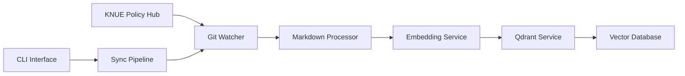

# KNUE Policy Vectorizer

한국교원대학교 정책 문서를 Qdrant 벡터 데이터베이스에 동기화하는 자동화 파이프라인

[](./tests)
[](https://python.org)
[](https://qdrant.tech)
[](https://huggingface.co/BAAI/bge-m3)
[](https://docker.com)
[](./tests)

## 📋 개요

KNUE Policy Vectorizer는 [한국교원대학교 정책 Hub](https://github.com/kadragon/KNUE-Policy-Hub) 저장소의 마크다운 정책 문서들을 자동으로 처리하여 Qdrant 벡터 데이터베이스에 저장하는 시스템입니다.

### 🎯 주요 기능

- **📂 Git 저장소 자동 감시**: 정책 문서 변경사항 실시간 추적
- **📝 마크다운 전처리**: Frontmatter 제거, 제목 추출, 메타데이터 생성
- **🤖 임베딩 생성**: BGE-M3 모델을 통한 1024차원 벡터 생성
- **🔍 벡터 검색**: Qdrant를 통한 고성능 유사도 검색
- **⚡ 증분 동기화**: 변경된 파일만 선별적으로 처리
- **🔄 전체 재인덱싱**: 필요시 전체 문서 재처리
- **💻 CLI 인터페이스**: 명령줄을 통한 쉬운 조작

## 🏗️ 시스템 아키텍처



### 구성요소

- **GitWatcher**: Git 저장소 모니터링 및 변경사항 추적
- **MarkdownProcessor**: 마크다운 문서 전처리 및 메타데이터 추출
- **EmbeddingService**: Ollama를 통한 BGE-M3 임베딩 생성
- **QdrantService**: 벡터 데이터베이스 연동 및 관리
- **SyncPipeline**: 전체 파이프라인 오케스트레이션

## 🚀 빠른 시작

### 전제 조건

- **Python 3.9+** (Python 3.11 권장)
- **[uv](https://docs.astral.sh/uv/)** 패키지 매니저
- **[Ollama](https://ollama.com/)** (bge-m3 모델)
- **[Docker & Docker Compose](https://docker.com)** (Qdrant 실행용)
- **최소 2GB RAM** (임베딩 처리용)

### 1. 저장소 클론 및 설정

```bash
git clone https://github.com/yourusername/knue-policy-vectorizer.git
cd knue-policy-vectorizer

# uv 패키지 매니저 설치 (없는 경우)
curl -LsSf https://astral.sh/uv/install.sh | sh

# 의존성 설치 및 개발 환경 구성
uv sync

# 개발 모드로 패키지 설치
uv pip install -e .
```

### 2. 외부 서비스 설정

#### Ollama 설정 (필수)

```bash
# Ollama 설치 및 실행
ollama serve

# bge-m3 임베딩 모델 다운로드 (약 2.2GB)
ollama pull bge-m3

# 모델 확인
ollama list
```

#### Qdrant 설정 (Docker)

```bash
# Qdrant 벡터 데이터베이스만 시작 (개발용)
docker-compose up -d qdrant

# 상태 확인
curl http://localhost:6333/collections

# 대시보드 접근 (선택사항)
# http://localhost:6333/dashboard
```

### 3. 환경 설정 (선택사항)

```bash
# 기본 설정 파일 복사
cp .env.example .env

# 필요시 설정 수정
vim .env
```

### 4. 시스템 검증

```bash
# 모든 서비스 상태 확인
uv run python -m src.sync_pipeline health

# 출력 예시:
# 🔍 Checking service health...
# ✅ All services are healthy
```

### 5. 첫 동기화 실행

```bash
# 전체 재인덱싱 (최초 실행 권장)
uv run python -m src.sync_pipeline reindex

# 또는 증분 동기화
uv run python -m src.sync_pipeline sync
```

## 💻 사용법

### CLI 명령어

이 시스템은 세 가지 주요 명령어를 제공합니다:

#### 1. 헬스체크

```bash
# 모든 서비스 상태 확인
uv run python -m src.sync_pipeline health

# 출력 예시:
# 🔍 Checking service health...
# ✅ All services are healthy
#   - Qdrant: Connected (localhost:6333)
#   - Ollama: Connected (bge-m3 model ready)
#   - Git Repository: Accessible
```

#### 2. 증분 동기화 (권장)

```bash
# 변경된 파일만 처리
uv run python -m src.sync_pipeline sync

# 출력 예시:
# 🔄 Starting sync pipeline...
# ✅ Sync completed successfully
#   - Processed: 3 files
#   - Upserted: 3 vectors
#   - Deleted: 0 vectors
#   - Skipped: 97 files (no changes)
```

#### 3. 전체 재인덱싱

```bash
# 모든 파일을 재처리 (최초 실행 또는 전체 재구축 시)
uv run python -m src.sync_pipeline reindex

# 출력 예시:
# 🔄 Starting full reindex...
# ✅ Reindex completed successfully
#   - Total files: 100
#   - Successfully processed: 98
#   - Failed: 2 (token limit exceeded)
#   - Total vectors: 98
```

### 환경 설정

`.env` 파일을 생성하여 설정을 커스터마이즈할 수 있습니다:

```bash
# 기본 설정 파일 복사
cp .env.example .env
```

#### 주요 설정 옵션

```env
# Git 저장소 설정
GIT_REPO_URL=https://github.com/KNUE-CS/KNUE-Policy-Hub.git
GIT_BRANCH=main

# 서비스 URL
QDRANT_URL=http://localhost:6333
OLLAMA_URL=http://localhost:11434
OLLAMA_MODEL=bge-m3

# 컬렉션 설정
COLLECTION_NAME=knue_policies
VECTOR_SIZE=1024

# 처리 제한
MAX_TOKEN_LENGTH=8192
MAX_DOCUMENT_CHARS=30000
BATCH_SIZE=10

# 로깅
LOG_LEVEL=INFO
LOG_FILE=logs/vectorizer.log
```

### 고급 사용법

#### 상세 로그 출력

```bash
# DEBUG 레벨 로그로 실행
LOG_LEVEL=DEBUG uv run python -m src.sync_pipeline sync

# 또는 환경 변수로 설정
export LOG_LEVEL=DEBUG
uv run python -m src.sync_pipeline sync
```

#### 특정 설정으로 실행

```bash
# 다른 저장소 URL로 실행
GIT_REPO_URL=https://github.com/your-org/your-repo.git uv run python -m src.sync_pipeline sync

# 다른 컬렉션 이름으로 실행
COLLECTION_NAME=test_collection uv run python -m src.sync_pipeline reindex
```

#### 프로그래매틱 사용

```python
from src.sync_pipeline import SyncPipeline
from src.config import Config

# 기본 설정으로 파이프라인 생성
pipeline = SyncPipeline()

# 헬스체크
health_status = pipeline.health_check()

# 동기화 실행
sync_result = pipeline.sync()

# 커스텀 설정으로 파이프라인 생성
config = Config()
config.qdrant_url = "http://custom-qdrant:6333"
pipeline = SyncPipeline(config)
```

## 🧪 테스트

### 전체 테스트 실행

```bash
# 모든 단위 테스트 실행
uv run pytest tests/ -v

# 특정 모듈 테스트
uv run pytest tests/test_sync_pipeline.py -v

# 통합 테스트 실행
uv run python scripts/test_full_sync_pipeline.py
```

### 테스트 커버리지

현재 **104개의 테스트**가 모든 주요 기능을 검증합니다:

- ✅ Git 저장소 감시 (13개 테스트)
- ✅ 마크다운 전처리 (17개 테스트)
- ✅ 임베딩 생성 (20개 테스트)
- ✅ Qdrant 연동 (25개 테스트)
- ✅ 동기화 파이프라인 (21개 테스트)
- ✅ 기본 설정 (5개 테스트)
- ✅ Qdrant 연결 (4개 테스트)

## 📊 성능

### 벤치마크 결과

- **임베딩 생성**: 평균 0.129초/문서
- **벡터 저장**: 평균 0.012초/문서
- **검색 속도**: 1000개 문서에서 < 0.1초
- **메모리 사용량**: 약 500MB (1000개 문서 기준)

### 처리 가능한 문서 유형

- ✅ 한국어 정책 문서
- ✅ YAML/TOML Frontmatter 포함 마크다운
- ✅ 최대 8,192 토큰 (약 30,000자)
- ✅ UTF-8 인코딩

## 🔧 개발

### 프로젝트 구조

```
knue-policy-vectorizer/
├── src/                          # 소스 코드
│   ├── config.py                 # 설정 관리
│   ├── git_watcher.py           # Git 저장소 감시
│   ├── markdown_processor.py    # 마크다운 전처리
│   ├── embedding_service.py     # 임베딩 생성
│   ├── qdrant_service.py        # Qdrant 연동
│   ├── sync_pipeline.py         # 메인 파이프라인
│   └── logger.py                # 로깅 설정
├── tests/                        # 테스트 코드
├── scripts/                      # 유틸리티 스크립트
├── config/                       # 설정 파일
└── test_data/                    # 테스트 데이터
```

### 개발 환경 설정

```bash
# 개발 의존성 설치
uv sync --group dev

# 코드 포맷팅
uv run black src/ tests/
uv run isort src/ tests/

# 타입 검사
uv run mypy src/

# 테스트 실행
uv run pytest tests/ -v --cov=src/
```

### TDD 개발 프로세스

이 프로젝트는 **테스트 주도 개발(TDD)** 방법론을 따릅니다:

1. 🔴 **Red**: 실패하는 테스트 작성
2. 🟢 **Green**: 테스트를 통과하는 최소 코드 작성
3. 🔵 **Refactor**: 코드 개선 및 최적화

## 🐳 Docker 배포

Docker를 사용하면 복잡한 환경 설정 없이 전체 시스템을 실행할 수 있습니다.

### 아키텍처

```
┌─────────────────┐    ┌─────────────────┐    ┌─────────────────┐
│   Host Machine  │    │  Docker Network │    │  Docker Network │
│                 │    │                 │    │                 │
│  Ollama:11434   │◄───┤  Indexer        │◄───┤  Qdrant:6333    │
│  bge-m3 model   │    │  (Python App)   │    │  (Vector DB)    │
└─────────────────┘    └─────────────────┘    └─────────────────┘
                              │
                              ▼
                    ┌─────────────────┐
                    │  Git Repository │
                    │  KNUE-Policy-Hub│
                    └─────────────────┘
```

### 빠른 시작

#### 1. 전제 조건

```bash
# Ollama가 호스트에서 실행 중인지 확인
ollama serve
ollama pull bge-m3

# Docker 상태 확인
docker --version
docker-compose --version
```

#### 2. 기본 실행 (자동 스케줄링)

```bash
# 모든 서비스 시작 (Qdrant + 자동 동기화)
docker-compose up -d

# 로그 확인
docker-compose logs -f indexer

# 서비스 상태 확인
docker-compose ps
```

#### 3. 수동 실행 (개발용)

```bash
# Qdrant만 시작
docker-compose up -d qdrant

# 일회성 동기화 실행
docker-compose run --rm indexer uv run python -m src.sync_pipeline sync

# 헬스체크
docker-compose run --rm indexer uv run python -m src.sync_pipeline health
```

### 고급 배포 옵션

#### Cron 스케줄링 (프로덕션 권장)

```bash
# Cron 기반 스케줄러 사용
docker-compose -f docker-compose.cron.yml up -d

# 스케줄 설정:
# - 매시간 sync (0 * * * *)
# - 15분마다 health check (*/15 * * * *)
# - 일요일 2시 전체 reindex (0 2 * * 0)
```

#### 환경 변수 커스터마이징

```bash
# Docker 전용 환경 설정 사용
cp .env.docker .env.production

# 환경 설정 수정
vim .env.production

# 커스텀 환경으로 실행
docker-compose --env-file .env.production up -d
```

### 관리 명령어

#### 서비스 관리

```bash
# 모든 서비스 중지
docker-compose down

# 특정 서비스만 재시작
docker-compose restart indexer

# 서비스 상태 확인
docker-compose ps

# 리소스 사용량 확인
docker-compose top
```

#### 로그 관리

```bash
# 실시간 로그 확인
docker-compose logs -f

# 특정 서비스 로그
docker-compose logs -f indexer
docker-compose logs -f qdrant

# 로그 파일 크기 제한
docker-compose logs --tail=100 indexer
```

#### 데이터 관리

```bash
# Qdrant 데이터 백업
docker run --rm -v knue-policy-vectorizer_qdrant_storage:/data \
  -v $(pwd)/backups:/backup alpine \
  tar czf /backup/qdrant-$(date +%Y%m%d).tar.gz -C /data .

# 볼륨 확인
docker volume ls | grep knue

# 볼륨 정리 (주의: 데이터 삭제됨)
docker-compose down -v
```

### 성능 튜닝

#### 메모리 설정

```yaml
# docker-compose.override.yml
services:
  indexer:
    deploy:
      resources:
        limits:
          memory: 1G
        reservations:
          memory: 512M
  qdrant:
    deploy:
      resources:
        limits:
          memory: 2G
```

#### 배치 크기 조정

```bash
# 메모리가 부족한 경우 배치 크기 줄이기
docker-compose run --rm \
  -e BATCH_SIZE=5 \
  indexer uv run python -m src.sync_pipeline sync
```

### 트러블슈팅

#### 일반적인 문제

**1. Ollama 연결 실패**

```bash
# 호스트에서 Ollama 상태 확인
curl http://localhost:11434/api/version

# Docker에서 호스트 접근 테스트
docker run --rm --add-host=host.docker.internal:host-gateway \
  alpine sh -c "wget -qO- http://host.docker.internal:11434/api/version"
```

**2. Qdrant 연결 실패**

```bash
# Qdrant 컨테이너 상태 확인
docker-compose ps qdrant

# Qdrant 로그 확인
docker-compose logs qdrant

# 수동 연결 테스트
docker-compose run --rm indexer curl http://qdrant:6333/collections
```

**3. 볼륨 권한 문제**

```bash
# 로그 디렉토리 권한 설정
mkdir -p logs repo_cache
chmod 755 logs repo_cache

# 소유권 변경 (필요한 경우)
sudo chown -R $(id -u):$(id -g) logs repo_cache
```

### 모니터링

#### Qdrant 대시보드

- URL: <http://localhost:6333/dashboard>
- 컬렉션 상태, 벡터 수, 메모리 사용량 확인

#### 헬스체크 엔드포인트

```bash
# Qdrant 헬스체크
curl http://localhost:6333/health

# 컨테이너 헬스체크
docker-compose ps --filter "health=healthy"
```

#### 로그 모니터링

```bash
# 에러 로그만 필터링
docker-compose logs indexer 2>&1 | grep ERROR

# 특정 시간 이후 로그
docker-compose logs --since="1h" indexer
```

자세한 Docker 사용법은 [DOCKER.md](DOCKER.md)를 참고하세요.

## 📈 모니터링

### 로그 수준

- `DEBUG`: 상세한 디버깅 정보
- `INFO`: 일반적인 작업 정보 (기본값)
- `WARNING`: 경고 메시지
- `ERROR`: 오류 정보

### 구조화된 로깅

모든 로그는 JSON 형태로 구조화되어 출력됩니다:

```json
{
  "event": "Sync completed",
  "pipeline": "sync",
  "status": "success",
  "upserted": 15,
  "deleted": 2,
  "failed": 0,
  "timestamp": "2025-01-01T12:00:00Z"
}
```

## 🛠️ 트러블슈팅

### 일반적인 문제

#### 1. 서비스 연결 문제

**Ollama 연결 실패**

```bash
# Ollama 서비스 상태 확인
curl http://localhost:11434/api/version

# Ollama 프로세스 확인
ps aux | grep ollama

# Ollama 재시작
pkill ollama
ollama serve

# bge-m3 모델 확인
ollama list
ollama pull bge-m3  # 없는 경우 다운로드
```

**Qdrant 연결 실패**

```bash
# Qdrant 상태 확인
curl http://localhost:6333/collections

# Docker 컨테이너 상태 확인
docker-compose ps qdrant

# Qdrant 재시작
docker-compose restart qdrant

# 포트 충돌 확인
lsof -i :6333
```

**Git 저장소 접근 문제**

```bash
# 저장소 접근 권한 확인
curl -I https://github.com/KNUE-CS/KNUE-Policy-Hub.git

# SSH 키 설정 (Private 저장소인 경우)
ssh -T git@github.com

# 캐시 디렉토리 권한 확인
ls -la repo_cache/
rm -rf repo_cache/  # 필요시 캐시 삭제
```

#### 2. 성능 및 메모리 문제

**메모리 부족**

```bash
# 현재 메모리 사용량 확인
free -h

# 배치 크기 줄이기
export BATCH_SIZE=5

# 토큰 제한 줄이기
export MAX_TOKEN_LENGTH=4096

# Worker 수 조정
export MAX_WORKERS=2
```

**처리 속도 느림**

```bash
# 병렬 처리 늘리기 (메모리 충분한 경우)
export MAX_WORKERS=8
export BATCH_SIZE=20

# Ollama GPU 활용 확인
ollama ps  # GPU 사용량 확인

# 네트워크 지연 확인
ping localhost  # 로컬 서비스 응답 시간
```

#### 3. 데이터 관련 문제

**문서 처리 실패**

```bash
# 문제 문서 확인 (DEBUG 로그 활성화)
LOG_LEVEL=DEBUG uv run python -m src.sync_pipeline sync

# 특정 파일 토큰 수 확인
echo "문서 내용" | wc -w  # 대략적인 토큰 수

# 인코딩 문제 확인
file repo_cache/your-repo/*.md  # 파일 인코딩 확인
```

**벡터 검색 정확도 문제**

```bash
# 컬렉션 상태 확인
curl http://localhost:6333/collections/knue_policies

# 벡터 차원 확인 (1024여야 함)
curl http://localhost:6333/collections/knue_policies | jq '.result.config.params.vectors'

# 샘플 검색 테스트
uv run python -c "
from src.qdrant_service import QdrantService
from src.config import Config
qs = QdrantService(Config())
print(qs.search_similar_documents('대학원 입학', limit=3))
"
```

#### 4. Docker 관련 문제

**컨테이너 시작 실패**

```bash
# 도커 로그 확인
docker-compose logs indexer
docker-compose logs qdrant

# 이미지 재빌드
docker-compose build --no-cache indexer

# 볼륨 권한 문제
sudo chown -R $(id -u):$(id -g) repo_cache logs
```

**네트워크 연결 문제**

```bash
# Docker 네트워크 확인
docker network ls
docker network inspect knue-policy-vectorizer_knue-network

# 컨테이너 간 연결 테스트
docker-compose exec indexer ping qdrant
docker-compose exec indexer curl http://qdrant:6333/collections
```

### 로그 분석

#### 로그 레벨 설정

```bash
# DEBUG 레벨로 상세 정보 확인
LOG_LEVEL=DEBUG uv run python -m src.sync_pipeline sync

# 특정 컴포넌트만 디버그
LOG_LEVEL=INFO uv run python -m src.sync_pipeline sync 2>&1 | grep "ERROR\|WARNING"
```

#### 일반적인 에러 메시지

**"Failed to connect to Ollama"**

- Ollama 서비스가 실행되지 않음
- 포트 11434가 사용 중이 아님
- 해결: `ollama serve` 실행

**"Collection does not exist"**

- Qdrant 컬렉션이 생성되지 않음
- 해결: `uv run python -m src.sync_pipeline reindex` 실행

**"Token limit exceeded"**

- 문서가 8192 토큰 제한을 초과
- 해결: `MAX_TOKEN_LENGTH` 환경 변수 조정 또는 문서 분할

**"Git repository not found"**

- 저장소 URL이 잘못됨
- 해결: `GIT_REPO_URL` 환경 변수 확인

#### 로그 파일 위치

```bash
# 로컬 실행 시
tail -f logs/vectorizer.log

# Docker 실행 시
docker-compose logs -f indexer

# 특정 에러만 확인
grep "ERROR" logs/vectorizer.log
```

### 성능 최적화

#### 시스템 리소스 모니터링

```bash
# CPU/메모리 사용량 확인
htop

# Docker 리소스 사용량
docker stats

# 디스크 공간 확인
df -h
```

#### 설정 튜닝

```bash
# 고성능 서버용 설정
export MAX_WORKERS=12
export BATCH_SIZE=25
export MAX_TOKEN_LENGTH=8192

# 저사양 환경용 설정
export MAX_WORKERS=2
export BATCH_SIZE=5
export MAX_TOKEN_LENGTH=4096
```

### 복구 절차

#### 전체 시스템 재설정

```bash
# 1. 모든 서비스 중지
docker-compose down

# 2. 캐시 및 로그 정리
rm -rf repo_cache/* logs/*

# 3. Qdrant 데이터 삭제 (선택사항)
docker volume rm knue-policy-vectorizer_qdrant_storage

# 4. 서비스 재시작
docker-compose up -d

# 5. 전체 재인덱싱
docker-compose run --rm indexer uv run python -m src.sync_pipeline reindex
```

#### 특정 컬렉션만 재생성

```bash
# Qdrant 컬렉션 삭제
curl -X DELETE http://localhost:6333/collections/knue_policies

# 재인덱싱
uv run python -m src.sync_pipeline reindex
```

### 지원 및 도움

문제가 지속되는 경우:

1. **GitHub Issues**: [프로젝트 이슈 페이지](https://github.com/kadragon/knue-policy-vectorizer/issues)에 문제 리포트
2. **로그 첨부**: 에러 로그와 시스템 정보 포함
3. **환경 정보**: OS, Python 버전, Docker 버전 명시
4. **재현 단계**: 문제 발생 과정을 단계별로 설명

## 🤝 기여하기

1. 이슈 생성 또는 기존 이슈 확인
2. 포크 및 브랜치 생성
3. TDD 방식으로 개발:
   - 테스트 작성 → 구현 → 리팩토링
4. 모든 테스트 통과 확인
5. Pull Request 생성

### 코드 스타일

- **Black**: 코드 포맷팅
- **isort**: Import 정렬
- **mypy**: 타입 검사
- **pytest**: 테스트 프레임워크

## 📄 라이선스

MIT License

## 📞 지원

- **이슈 리포트**: [GitHub Issues](https://github.com/kadragon/knue-policy-vectorizer/issues)
- **이메일**: <kangdongouk@gmail.com>
