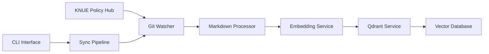

# KNUE Policy Vectorizer

한국교원대학교 정책 문서를 Qdrant 벡터 데이터베이스에 동기화하는 파이프라인

[](./tests)
[](https://python.org)
[](https://qdrant.tech)
[](https://huggingface.co/BAAI/bge-m3)

## 📋 개요

KNUE Policy Vectorizer는 [한국교원대학교 정책 Hub](https://github.com/kadragon/KNUE-Policy-Hub) 저장소의 마크다운 정책 문서들을 자동으로 처리하여 Qdrant 벡터 데이터베이스에 저장하는 시스템입니다.

### 🎯 주요 기능

- **📂 Git 저장소 자동 감시**: 정책 문서 변경사항 실시간 추적
- **📝 마크다운 전처리**: Frontmatter 제거, 제목 추출, 메타데이터 생성
- **🤖 임베딩 생성**: BGE-M3 모델을 통한 1024차원 벡터 생성
- **🔍 벡터 검색**: Qdrant를 통한 고성능 유사도 검색
- **⚡ 증분 동기화**: 변경된 파일만 선별적으로 처리
- **🔄 전체 재인덱싱**: 필요시 전체 문서 재처리
- **💻 CLI 인터페이스**: 명령줄을 통한 쉬운 조작

## 🏗️ 시스템 아키텍처



### 구성요소

- **GitWatcher**: Git 저장소 모니터링 및 변경사항 추적
- **MarkdownProcessor**: 마크다운 문서 전처리 및 메타데이터 추출
- **EmbeddingService**: Ollama를 통한 BGE-M3 임베딩 생성
- **QdrantService**: 벡터 데이터베이스 연동 및 관리
- **SyncPipeline**: 전체 파이프라인 오케스트레이션

## 🚀 빠른 시작

### 전제 조건

- Python 3.9 이상
- [uv](https://docs.astral.sh/uv/) 패키지 매니저
- [Ollama](https://ollama.ai/) (BGE-M3 모델 포함)
- [Qdrant](https://qdrant.tech/) 벡터 데이터베이스

### 1. 저장소 클론 및 설정

```bash
git clone <repository-url>
cd knue-policy-vectorizer

# 가상환경 생성 및 의존성 설치
uv sync
```

### 2. 서비스 실행

```bash
# Qdrant 실행 (Docker Compose)
docker-compose -f docker-compose.qdrant.yml up -d

# Ollama 실행 및 BGE-M3 모델 다운로드
ollama serve
ollama pull bge-m3
```

### 3. 헬스체크

```bash
# 모든 서비스 상태 확인
uv run python src/sync_pipeline.py health
```

### 4. 첫 동기화

```bash
# 전체 재인덱싱 (최초 실행시)
uv run python src/sync_pipeline.py reindex

# 증분 동기화
uv run python src/sync_pipeline.py sync
```

## 💻 사용법

### CLI 명령어

```bash
# 헬스체크
uv run python src/sync_pipeline.py health

# 증분 동기화 (변경된 파일만)
uv run python src/sync_pipeline.py sync

# 전체 재인덱싱 (모든 파일)
uv run python src/sync_pipeline.py reindex --yes
```

### 환경 변수 설정

`.env` 파일을 생성하여 설정을 커스터마이즈할 수 있습니다:

```env
# Git 저장소 설정
REPO_URL=https://github.com/kadragon/KNUE-Policy-Hub.git
BRANCH=main
REPO_CACHE_DIR=./repo_cache

# Qdrant 설정
QDRANT_URL=http://localhost:6333
QDRANT_COLLECTION=knue-policy-idx

# Ollama 설정
OLLAMA_URL=http://localhost:11434
EMBEDDING_MODEL=bge-m3

# 처리 설정
MAX_TOKENS=8192
VECTOR_SIZE=1024
LOG_LEVEL=INFO
```

## 🧪 테스트

### 전체 테스트 실행

```bash
# 모든 단위 테스트 실행
uv run pytest tests/ -v

# 특정 모듈 테스트
uv run pytest tests/test_sync_pipeline.py -v

# 통합 테스트 실행
uv run python scripts/test_full_sync_pipeline.py
```

### 테스트 커버리지

현재 **104개의 테스트**가 모든 주요 기능을 검증합니다:

- ✅ Git 저장소 감시 (13개 테스트)
- ✅ 마크다운 전처리 (17개 테스트)
- ✅ 임베딩 생성 (20개 테스트)
- ✅ Qdrant 연동 (25개 테스트)
- ✅ 동기화 파이프라인 (21개 테스트)
- ✅ 기본 설정 (5개 테스트)
- ✅ Qdrant 연결 (4개 테스트)

## 📊 성능

### 벤치마크 결과

- **임베딩 생성**: 평균 0.129초/문서
- **벡터 저장**: 평균 0.012초/문서
- **검색 속도**: 1000개 문서에서 < 0.1초
- **메모리 사용량**: 약 500MB (1000개 문서 기준)

### 처리 가능한 문서 유형

- ✅ 한국어 정책 문서
- ✅ YAML/TOML Frontmatter 포함 마크다운
- ✅ 최대 8,192 토큰 (약 30,000자)
- ✅ UTF-8 인코딩

## 🔧 개발

### 프로젝트 구조

```
knue-policy-vectorizer/
├── src/                          # 소스 코드
│   ├── config.py                 # 설정 관리
│   ├── git_watcher.py           # Git 저장소 감시
│   ├── markdown_processor.py    # 마크다운 전처리
│   ├── embedding_service.py     # 임베딩 생성
│   ├── qdrant_service.py        # Qdrant 연동
│   ├── sync_pipeline.py         # 메인 파이프라인
│   └── logger.py                # 로깅 설정
├── tests/                        # 테스트 코드
├── scripts/                      # 유틸리티 스크립트
├── config/                       # 설정 파일
└── test_data/                    # 테스트 데이터
```

### 개발 환경 설정

```bash
# 개발 의존성 설치
uv sync --group dev

# 코드 포맷팅
uv run black src/ tests/
uv run isort src/ tests/

# 타입 검사
uv run mypy src/

# 테스트 실행
uv run pytest tests/ -v --cov=src/
```

### TDD 개발 프로세스

이 프로젝트는 **테스트 주도 개발(TDD)** 방법론을 따릅니다:

1. 🔴 **Red**: 실패하는 테스트 작성
2. 🟢 **Green**: 테스트를 통과하는 최소 코드 작성
3. 🔵 **Refactor**: 코드 개선 및 최적화

## 🐳 Docker 배포

### Qdrant 서비스

```bash
# Qdrant 실행
docker-compose -f docker-compose.qdrant.yml up -d

# 상태 확인
curl http://localhost:6333/health
```

### 전체 시스템 배포 (예정)

```bash
# 전체 시스템 실행 (Ollama + Qdrant + Sync Pipeline)
docker-compose up -d
```

## 📈 모니터링

### 로그 수준

- `DEBUG`: 상세한 디버깅 정보
- `INFO`: 일반적인 작업 정보 (기본값)
- `WARNING`: 경고 메시지
- `ERROR`: 오류 정보

### 구조화된 로깅

모든 로그는 JSON 형태로 구조화되어 출력됩니다:

```json
{
  "event": "Sync completed",
  "pipeline": "sync",
  "status": "success",
  "upserted": 15,
  "deleted": 2,
  "failed": 0,
  "timestamp": "2025-01-01T12:00:00Z"
}
```

## 🛠️ 트러블슈팅

### 일반적인 문제

**1. Ollama 연결 실패**
```bash
# Ollama 서비스 상태 확인
ollama list

# BGE-M3 모델 다운로드
ollama pull bge-m3
```

**2. Qdrant 연결 실패**
```bash
# Qdrant 상태 확인
curl http://localhost:6333/health

# Docker 컨테이너 재시작
docker-compose -f docker-compose.qdrant.yml restart
```

**3. 메모리 부족**
```bash
# 토큰 제한 줄이기
export MAX_TOKENS=4096

# 배치 크기 조정
export MAX_WORKERS=2
```

### 로그 확인

```bash
# 실시간 로그 모니터링
uv run python src/sync_pipeline.py sync --verbose

# 로그 레벨 변경
LOG_LEVEL=DEBUG uv run python src/sync_pipeline.py sync
```

## 🤝 기여하기

1. 이슈 생성 또는 기존 이슈 확인
2. 포크 및 브랜치 생성
3. TDD 방식으로 개발:
   - 테스트 작성 → 구현 → 리팩토링
4. 모든 테스트 통과 확인
5. Pull Request 생성

### 코드 스타일

- **Black**: 코드 포맷팅
- **isort**: Import 정렬
- **mypy**: 타입 검사
- **pytest**: 테스트 프레임워크

## 📄 라이선스

MIT License - 자세한 내용은 [LICENSE](LICENSE) 파일을 참조하세요.

## 📞 지원

- **이슈 리포트**: [GitHub Issues](https://github.com/your-repo/issues)
- **문서**: [프로젝트 Wiki](https://github.com/your-repo/wiki)
- **이메일**: kadragon@knue.ac.kr

---

**Made with ❤️ by the KNUE Development Team**

한국교원대학교 정책 문서를 더 쉽게 검색하고 활용할 수 있도록 지원합니다.